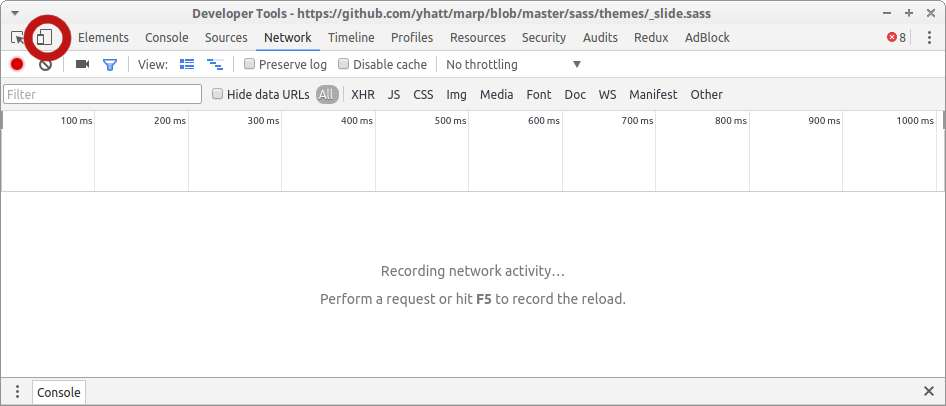

<style>
.slide {
	background-color:#000;
    color:#fff;
}
pre {
color:#000;
}

h1, h2, h3, h4, h5, h6 {
	color:#fff;
}
</style>
# Responsive 101
---

Une manière de concevoir des sites qui s'adapte à différentes tailles d'écrans et différents terminaux (print, projecteur, braille...)

---

Beaucoup de sources le confondent avec adaptive web design, qui au lieu des médias queries, utilisera des pourcentages (à leur décharge il n'y a pas de consensus sur ce sujet pour le moment)

---

# Exemples d'usages

- Afficher un menu différent en fonction de la taille de l'écran
- Cacher certaines parties à l'impression
- Un logo différent en fonciton de la taille
- Un design sur trois colonnes pour les grands écrans, et sur une seule colonne pour le mobile

---

# Syntaxe
```
@media screen and (min-width: 20em) 
and (max-width: 70em) {
  .foo {
    display:block;
    color: blue;
  }
}
```

---

```
@media screen and (min-width: 70em) {
  .foo {
    display:block;
    color: red;
  }
}
```


---

La syntaxe est simple, l'implémentation (bien conçue) compliquée

---

# Comment tester

Le plus fiable : sur différents terminaux

Le plus simple : votre navigateur avec les devtools

---



---


---
## Aller plus loin

[Les Media Queries - Alsacréations](http://www.alsacreations.com/article/lire/930-css3-media-queries.html)

---

# Exercices

---

## Exo 1
Créez une petite  page qui contient une `div`.
Le fond de cette `div` est :
- `blue` en dessous de `300px` 
- `red` entre `301px` et `600px`
- `green` au dessus de `601px`

---

## Exo 2
Créez deux menus :
- Le premier visible au dessous de `800px`, (un menu classique, sur une seule ligne tout en haut de la page
- Un deuxième qui peut changer d'état au click sur une icone ou un bouton menu en dessous de `800px` et dont les élément ssont les uns sous les autres et prennent toutes la largeur du navigateur

Vous trouverez un exemple sur AirBnB